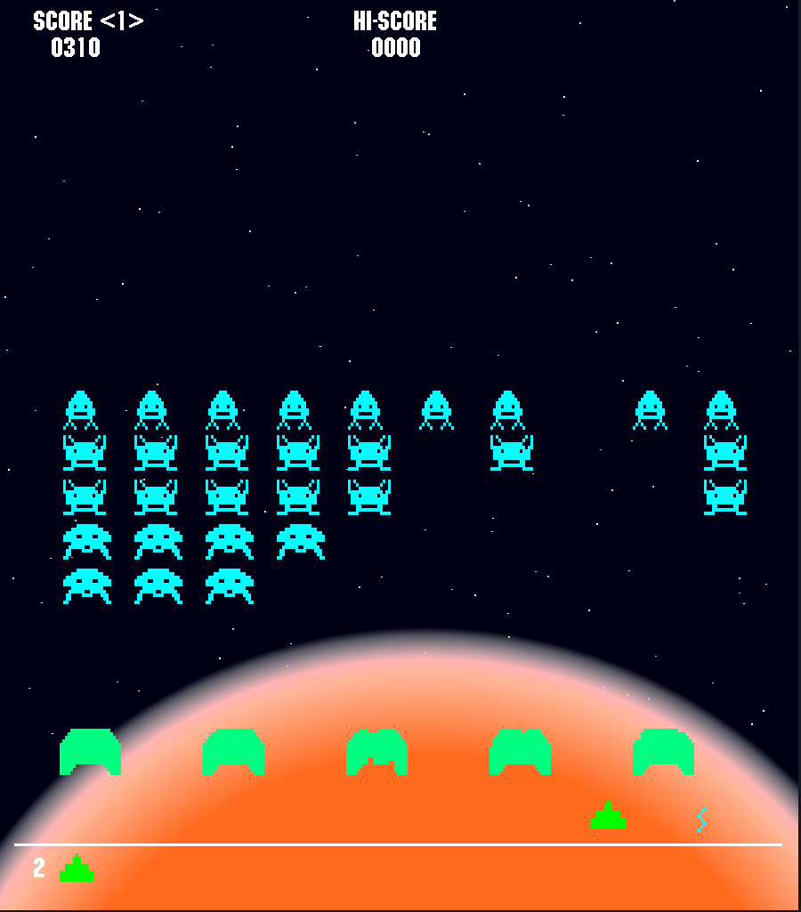

Planet Invaders
___

This is an emulation of Space Invaders written in Java.

 

## Features

* Authentic-look and feel to replicate the Space Invaders.
* 10 Levels, each new level starts with faster invaders movement speed and lower position on the screen.
* Invaders movement speed is increased, and they drop down further when they hit either side of the screen.
* UFO ship appears at different intervals from either direction.
* Destroying the UFO ship rewards you with mystery points (50, 100, 150) or 300pts when hit with every 23rd shot.
* 120 frames-per-second gameplay.
* Sound support to enhance the experience.
* Persistent high score tracking between runs.
* Restart or Quit the game after game over.

## Controls

| Keyboard    | Action                          |
|-------------|---------------------------------|
| Left Arrow  | Move left                       |
| Right Arrow | Move right                      |
| Space       | Fire                            |
| Enter       | Start game                      |
| R           | Restart Game (Game over screen) |
| Q           | Quit Game (Game over screen)    |


## Getting started

### Prerequisites

* Java Development Kit (JDK) (version 8 or later)
* Git (to clone the repository)
* An IDE (e.g., IntelliJ IDEA, Eclipse) or a text editor with Java support (e.g., Visual Studio Code)

### Clone the Repository

* Open your terminal or command prompt.
* Navigate to the directory where you want to clone the repository.
* Run the following command to clone the repository:

```
git clone https://github.com/nobletk/PlanetInvaders
```

### Build the project

* If you're using an IDE like IntelliJ IDEA or Eclipse, open the project directory.
* The IDE should automatically detect the project structure and build it.
* If you're using the terminal, ensure that you have the necessary build tools configured, and run the appropriate build
  command (e.g., javac for compiling Java files).

### Run the game

* Locate the main class that starts the game. This is Main.java .
* If you're using an IDE, right-click on the Main.java file and select Run.
* If you're using the terminal, navigate to the src directory and run the following command:

```
java Main
```

